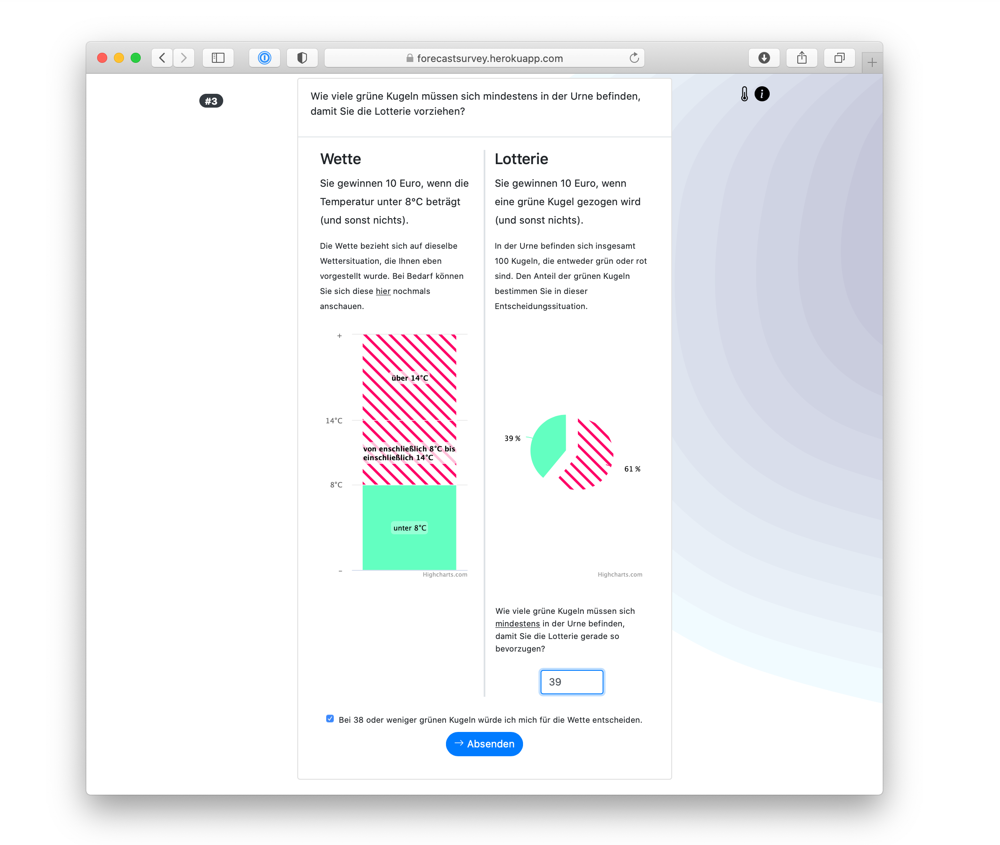

# 🌦 What makes a (weather) forecast credible?

## 🎓 What the project is about
This project is the foundation of an economic experiment that exposes respondents to forecasts and manipulates the 
forecasts' communication strategies between subjects. We elicit the respondents' belief distribution (MPP) and 
ambiguity attitudes (Baillon) before and after exposure to assess forecasts' credibility.

We retrieve the belief distributions using Eyting & Schmidt's 
[(2020, Working Paper)](https://download.uni-mainz.de/RePEc/pdf/Discussion_Paper_1818.pdf)
Multiple Point Predictions (MPP) which is implemented in a binarized fashion using Hossain & Okui's 
[(2013, Review of Economic Studies)](https://www.jstor.org/stable/43551453) 
binarized scoring rule. The ambiguity attitudes are elicited using Baillon et al.'s [(2018, Econometrica)]( https://doi.org/10.3982/ECTA14370) 
Method. 

## 🚏 How you can access it
You can find the experiment's demo [here](https://forecastsurvey.herokuapp.com/demo/). The link allows you to open 
three apps
- `Baillon_MPP`,
- `MPP_Standalone`,
- `Baillon_Standalone`.

The two standalone are slices of the `Baillon_MPP` app which were created to save time if one is solely interested in one
of the implementations. To get the better user experience, I recommend to click through the complete (i.e. the 
Baillon_MPP) app.

A click on one of the apps will create a session and redirect you to a page containing lots of URLs. Click on the
_Session-wide link_ to open the experiment. After reading through the instructions, you should end up seeing a decision 
screen looking like this one:

## 📖 Read the docs
I am creating a wiki [over here](https://github.com/Howquez/forecast-uncertainty/wiki).

## 🛠 How we build it

### Tech stack
The experiment itself is based on [oTree](https://www.sciencedirect.com/science/article/pii/S2214635016000101), 
a Python module designed to build surveys and experiments. It utilizes 
Python, JavaScript, HTML & CSS (mostly bootstrap 4.1.x). The corresponding analysis is done with R.

### App Sequence
As a consequence, there are two different groups of apps. One relying on Baillon+BSR and another one relying on 
Baillon+MPP.

The experiment first elicits uncertainty attitudes, then beliefs. Afterwards an information treatment is 
provided. Subsequently, uncertainty attitudes and beliefs are elicited once more. The experiment closes with
a payoff calculation, a short questionnaire and  the payoff revelation. Because the apps (Baillon and MPP) are played 
twice, the structure of this experiment is a little unusual because it cannot solely rely on rounds but also utilizes 
clones of these apps.

As a consequence, the experiment is based on the following app sequence: 

[[initialize](initialize), [Baillon](Baillon), [MPP](MPP), [postBaillon](postBaillon), [postMPP](postMPP), 
[terminate](terminate)]

where _initialize_ is an app that initially writes some variables into the participant scope that are 
retrieved later on. Similarly, _terminate_ is an app that closes the survey by providing information stored
in the participant.vars. The reason I built these apps was to decouple the other apps easily, if needed.

### Page Sequence 
I haven't been working on the BSR app recently. For this reason I will explain the Baillon+MPP survey in what follows.
The templates, i.e. the pages the respondents see, are displayed in the following order:
1. [Intro_Welcome](initialize/templates/initialize/Intro_Welcome.html)
2. [Intro_Instructions](initialize/templates/initialize/Intro_Instructions.html)
3. [Baillon_Instructions](Baillon/templates/Baillon/Baillon_Instructions.html)
4. [Baillon_Confirmation](Baillon/templates/Baillon/Baillon_Confirmation.html)
5. [Baillon_Decision](Baillon/templates/Baillon/Baillon_Decision.html) (6 rounds)
6. [Baillon_Direct](Baillon/templates/Baillon/Baillon_Direct.html)
7. [MPP_Instructions](MPP/templates/MPP/MPP_Instructions.html)
8. [MPP_Confirmation](MPP/templates/MPP/MPP_Confirmation.html)
9. [MPP_Decision](MPP/templates/MPP/MPP_Decision.html)
10. [MPP_Direct](MPP/templates/MPP/MPP_Direct.html)
11. [Baillon_Decision](Baillon/templates/Baillon/Baillon_Decision.html) (6 rounds)
12. [Baillon_Direct](Baillon/templates/Baillon/Baillon_Direct.html) 
13. [MPP_Decision](MPP/templates/MPP/MPP_Decision.html)
14. [MPP_Direct](MPP/templates/MPP/MPP_Direct.html)
15. [Domain_Questions_1](terminate/templates/terminate/Domain_Questions_1.html)
16. [Domain_Questions_2](terminate/templates/terminate/Domain_Questions_2.html)
17. [CLICCS_Questions](terminate/templates/terminate/CLICCS_Questions.html)
18. [Demographic_Questions](terminate/templates/terminate/Demographic_Questions.html)
19. [Results](terminate/templates/terminate/Results.html)

These templates utilize variables attached to the models (player, group, subsession, participant,...) as well as
variables passed to the template via `vars_for_template` method or variables passed to the js files via `js_vars` method
(both is done within the respective pages.py files). These variables are then used as arguments in 
[twig(?)](https://twig.symfony.com/doc/2.x/intro.html) logic such as if statements and loops in the templates.

## To do
[Here](https://github.com/Howquez/forecast-uncertainty/projects/1) is the corresponding kanban board.

